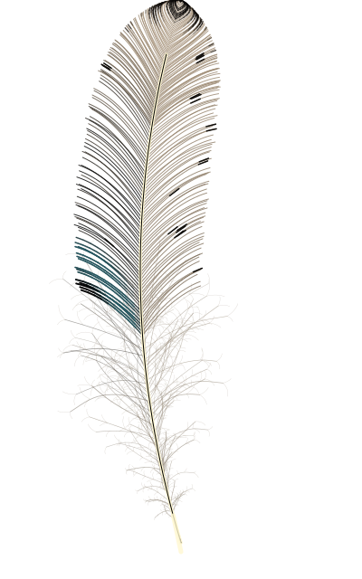

# FEAFFER

**An instrument for the faffing of feathers.**

<p align="center">
  
</p>

<p align="center">
  <b><a href="https://www.or-ni-thology.cloud/feaffer/">Open Feaffer →</a></b>
</p>

---

Feaffer is the first stage of a game — imaginary feathers scattered over a map of the moors, to be found by walking. But first the feathers themselves had to be found, and it turns out feather-faffing is its own reward.

The house rule: **if is feather, we should try.** Failure and frivolity is always an option. Feaffer is for fun.

## Running it

It is one HTML file. No dependencies, no build, no install.

```
git clone https://github.com/YOURNAME/feaffer.git
open feaffer/index.html
```

Or just [use the live one](https://www.or-ni-thology.cloud/feaffer/).

## What it does

It opens on a different feather every time. A grid reference conjures a specific one; **Wander** rolls a fresh reference and conjures that. Two drawers of controls — **Form** (the shape of the thing) and **Colour** (pigment, pattern, and the structural sheen) — faff it from there, each colour dialled on a built-in H·S·L picker made for the muted, greyed-off tones feathers actually wear.

Three ways to take a feather away:

| | |
|---|---|
| **Specimen** | The vector, as SVG. |
| **Portrait** | A shareable card as PNG — the feather stood on the sky-grey with its grid reference at the foot, like a museum tag. |
| **Record** | The whole state as plain text. |

A Record is round-trippable: **Restore** reads one back and reconjures that exact feather, draw seed and all — so a specimen faffed up while the kettle boils is never lost to the browser again.

---


<h2>How the feather is made</h2>

Feaffer draws no bitmaps and stamps no textures. A feather is a few hundred thin strokes on an SVG, each one placed by the same handful of equations a real feather more or less obeys. What follows is the whole of it, plainly — because the pleasure of the thing is partly in seeing the grain of the maths through the finish, and because someone may want to grow their own.

### The shaft — a curve with two ends

The rachis is a single quadratic Bézier from the calamus at the base to the tip:

> B(t) = (1−t)²·base + 2(1−t)t·control + t²·tip

with the control point pushed sideways by the curvature, which is the wind the feather grew against. At any *t* along it we can take the tangent, and turn it a right angle for the normal — the across-vane direction the barbs comb out along. Under asymmetry the whole shaft drifts toward the leading edge (by `asym · breadth · 0.22`), the way a flight feather's does. The visible quill stops at *t* = 0.9; the last tenth is closed by barbs, not by drawing the shaft to a point.

The quill drawn on that curve is a **spindle**, not a stripe — a run of half-widths laid up one flank and back down the other, thickest where the vane first leans on it and thinning all the way along, its stoutness taken from the feather's own breadth so a magpie's tail carries a heavier shaft than a wren's flank feather. The same taper, read further, is the acuminate's fine sprig past the last drawable barb. Read *below* the base — the frame extrapolates happily — it is the calamus: swelling gently through its middle, coming back to the rachis's own width at the top so the quill is one continuous thing, rounding off at its foot on a quarter-circle, with the inferior umbilicus a dark point at the end of it. Not three things. One quill, read at three thicknesses. The umbilical groove is a spindle too, closing to points at both ends rather than stopping square at the shoulder.

### The vane — a width, and three ways to close

A single function `width(t)` gives the vane's half-breadth all along the shaft. Below the widest point (peak ≈ 0.63) it eases up as `sin(u·π/2)^0.85`, lifted onto a **shoulder** so that it does not run all the way to nothing at the base. A vane does not come to a point at the bottom; it *begins*, at the superior umbilicus, at a definite width, with the lowest barbs already a fair reach long. Running the ease to zero drew the foot of every feather as a needle — and on a well-downed feather the fluff stands in front of that and you never see it, but on a feather with little down the spear was the whole of the base. Above it, a feather closes in one of three families — because a feather's tip is categorical, not a slider, and the old continuous pointy-to-round blend always ran two closing mechanisms at once and lived in the lumps between them. Field guides know three, and each has its own mathematics:

- **Rounded** is a quarter of a superellipse, `w = √(1 − uᵖ)`. For any power *p* ≥ 1 it is convex everywhere, so a dome has nowhere to dent inward — blunt or slender, never lumpy. And *p* is measured in pixels, not chosen in the abstract: it is set so the dome turns over as deep along the shaft as the vane is wide across, so a magpie's long tail-feather stays as round at the tip as a short body feather. It closes by **wrap** — and wrap turns out to want no help: once the landing is solved properly the comb walks the whole dome by itself, and the fan below only bends the barbs to arrive along it.

- **Acuminate** is a taper, `w = (1−u)ᵏ`. Raising *k* bends the edge concave — the sweeping hollow needle of a pheasant's tail. Concavity is honest here; it is what acuminate means. It closes by taper alone: the vane shortens to nothing, and a fine sprig of bare quill carries the very point past where a drawable barb gives out.

- **Truncate** is the rounded body, cut. The barbs shear off along a growth contour — level with the cut at the shaft, drooping gently down each web — and the corner where the cut meets the side of the vane is rounded by a smooth minimum of the two edges, whose radius is the one degree of freedom: crisp square to soft-shouldered.

Asymmetry then steals breadth from the leading web and gives it to the trailing one, and `cos(barb angle)` sets how much of a barb's length is spent reaching across the vane versus up it.

### The barbs — combed, and made to land on the edge

The barbs are combed in rows up the shaft. Each barb leaves the shaft at the barb angle and has to be exactly long enough to land its tip on the vane's outline — and here is the one properly subtle sum in the tool.

A barb climbs as it reaches out, so it lands its tip higher up the edge than its root; reading the width at the root let a barb on a short broad feather climb clean past the crown at full breadth (a square-shouldered fat head). So the landing is **solved**, not read.

It was solved for a long while by a damped fixed point, `bl ← ½·bl + ½·width(t + bl·sinθ/L)`, a few turns until the tip sat on the envelope — damped, because the envelope's steep tip-end would make the bare iteration ring. It held fine down the shaft and rang anyway wherever the envelope turned steep, which is the whole of a rounded crown. Above *t* ≈ 0.95 it stopped converging at all. Measured on a broad rounded feather, the last rows landed at arc 119.9, then 110.3, then 115.1, 119.9, 123.8 — out of order, some of them *below* the row beneath. That was the lumpy tip.

It is **bisection** now, on the landing parameter rather than the length. The residual

> (h − t)/climb − width(h)

starts negative at the root, ends positive at the apex, and rises all the way between, so a bracket can always be halved onto the crossing. Sixteen halvings put it inside a hundredth of a pixel, and the landings come out monotone and evenly spaced — a tip every three pixels, right over the apex.

Two more honesties keep the vane silky: the tip jitter is scaled back by a barb's slope (≈ `0.12 · min(1, tan46°/tanθ)`, 46° being the default comb), so a near-vertical barb's shake doesn't fling its tip wide of the edge; and on rounded tips a closing **fan** bends each near-apex barb so it leaves the shaft like its neighbours but *arrives* skimming the crown — its arc's control point placed where those two directions cross.

The fan used to do more than that, and wanted to do less. It hauled every tip-zone barb's endpoint toward a target near the axis, shrinking the target the higher the row, so the strokes converged on one point and combed a ladder of nested chevrons down the middle of the dome with a knot at the top of it. It was there because the broken solve left the top sixth of the crown's arc unreached by anything at all, and something had to get strokes up there. With the landing solved, the haul is gone. The fan is curvature now, not position, and a barb's tip is where the comb put it.

### The gauge — a gap is read against the barb it is a gap in

The rows were ruled flat up the rachis, *t* = *i*/(*n*−1), which sounds even and is not. It keeps the gap between neighbours at the same number of **pixels** everywhere — but nobody reads a gap in pixels. A gap is read against the thing it is a gap *in*, and the barbs get short at the ends of a feather while the gaps do not. Measured on a plain specimen, the gap as a fraction of a barb's own length:

| | mid-vane | *t* = 0.8 | *t* = 0.9 |
|---|---|---|---|
| rounded | 3.8% | 5.3% | 13.2% |
| acuminate | 4.0% | 16.6% | **59.4%** |

Two and a half pixels between eighty-five-pixel barbs is a silky weave. The same two and a half pixels between five-pixel barbs is a comb with teeth, and near the point of an acuminate the gaps ran longer than half a barb. Which is why every tip in this tool read as a fish bone however far the density slider went: **the density slider was buying rows in the one place that already had enough of them.**

So the pitch follows the barb's length, and the weave holds **one gauge** from calamus to crown. Where the vane narrows the rows crowd, in exactly the proportion the narrowing asks for, and nothing else in the tool has to be told about it. The density slider stops being a count of rows and becomes what it always meant — the gauge of the weave, set at the broadest part.

It replaces the crown's interleaved sub-rows, which were this same idea at a third of the resolution: an integer of 1, 2 or 3, measured only over a rounded dome, and reading 1 nearly always. The right instinct asked of the wrong quantity. It is not the crown that wants more rows, it is *every place a barb is short* — and the acuminate, which wanted them most, was never asked.

Two things bound it. The gauge is a proportion, and a proportion of nothing is nothing, so there is a **floor** under the crowding — without one, the vanishing point of an acuminate would grind there forever. And the whole pitch opens by one factor if the predicted row count overruns its budget, so the gauge keeps its *shape* — the tip still crowds exactly as much more than the mid-vane as its barbs are shorter — while the feather keeps near the count that was asked for. A redistribution with a cap on it, rather than a multiplication.

And **the gauge reads the vane, because the vane is where the barbs hold on to one another.** A plumaceous barb is held by nothing and obeys no outline; it is a cloud, not a web, so there is no gap there to keep in proportion. Crowding rows into the down bought nothing but more fluff to hide behind the fluff already in front of it — measured, that was two thirds of what the gauge cost and none of what it bought. So below the down line the rows keep the plain pitch. One more thing the plumaceous zone is simply not the business of.

### The ragged margin, and a trade taken on purpose

The vane's edge has always wandered a little — slightly, noticeably, worst around the middle of the feather. It is worth writing down what that is, because the answer is not the obvious one and the fix was declined deliberately.

It is **not** the tips landing off course. It is the **bays between them**. Between one tip and the next the outline falls back onto the flank of the barb below, so the margin is a fine scallop; evenly spaced tips give a regular sawtooth the eye reads as texture, and the tip jitter makes the spacing irregular, which is what reads as ragged. Three measurements say so: silence the jitter and the wander halves (4.47 → 2.16 px); crowd the tips and it falls monotonically (6.85 px at 60 barbs, 3.26 px at 170); and it is worst where the barbs are longest, which is the middle of the vane — exactly where it shows.

**Which is why the camber cures it.** A scallop's depth is an *across* distance, and compressing across-distances is the whole of what a camber does: the projection's derivative is cos(*a/R*), about 0.41 at the margin under a full curl, so every bay is squashed sideways by that factor while keeping its height. Measured, the wander falls by a third. It is the foreshortening alone and not the shading — turning the light off changes the margin by less than a quarter of a pixel. (The rest of the improvement, which the number cannot see, is that the vane thickens behind the edge — ink coverage in the outermost twenty pixels rises from 26% to 31% — so a bay has more ink behind it and reads as a soft margin rather than a gap.)

There **is** a real inconsistency underneath, found while chasing this and left alone. The vane's outline is `sideWidth × cos(the nominal comb angle)` — it assumes every barb arrives at the nominal angle, and a jittered barb does not, so its tip misses the envelope by about `bl·sin θ·δ`. Solving the landing on the barb's *across reach* rather than on its *length* fixes that properly: the tip locus goes from 1.64 to 0.40 px of wander. And it changes the rendered feather by almost nothing, because the rendered margin is the scallop, not the tips. It costs ten per cent more paths.

So it is not in. **Ten per cent of the blimey for something nobody can see is a bad trade**, and the house rule is that a thing earns its ink by showing. The four lines exist and can be had any day the trade changes — a bigger canvas, a denser comb, a reason to care about the tip locus for its own sake. Until then the margin is drawn by the geometry we have and smoothed by the curl, which is how a real feather manages it too.

### The knit — a vane is a web, not a comb

Every barb carries two ranks of **barbules**: the distal rank hooked, the proximal rank plain. One barb's hooks catch the next barb's plain rank, and that is what zips a vane into a single sheet you can hold up to the light. It is the one piece of a feather's structure the tool had no account of at all, and its absence is most of why a Feaffer vane read as a row of loose hairs with the sky showing between them — three quarters of the mid-vane was bare ground.

They are not drawn, and should not be — which was wrong, and instructively so. Barbs sit three or four pixels apart on this canvas and a real barb carries eight or ten barbules within that span, so a barbule is a fifth of a pixel: well under the sample rate, where the honest picture of a thing too fine to draw is the tone it averages to. So the first pass laid each barb twice — a soft ribbon about a barb-spacing wide, which was the barbules, and the crisp hairline over it, which was the barb. The argument is sound. The picture was flat, and it homogenised exactly the soft feathers it was meant to help.

Because a feather is not a tone with lines on it. It is a **hierarchy of line densities** — barbs at one pitch, barbules at a finer — and the eye reads the second order as *grain*, not as grey. Averaging it away is the one thing you must not do to it. The sample-rate argument was answering the wrong question: not "what is the mean brightness here" but "what is the finest order this page can still hold apart".

So they are drawn, and the under-sampling goes the other way: roughly one barbule in six, at the finest pitch the canvas can still resolve as separate lines, with the floor rising as the comb crowds and nothing ever moving it — past a point another rank is ink spent on a grey nobody can see. Two ranks per barb, leaning opposite ways, each reaching a shade past half the gap so it meets its neighbour's coming the other way, which is what interlocking *is*. A barbule reaches **for its neighbour**, so where there is no neighbour to reach for there is nothing to draw — that is what stopped a halo of stray whiskers standing off the apex, where the topmost barb was fringing out into open sky. And the ranks shorten hard over the last third of their run, because barbules do: the bare end of every barb is what keeps a vane's margin a crisp sawtooth of tips instead of a fuzz. Read against the rank's own run rather than the barb's, so a half-zipped vane fades out where its zip gives up instead of running full length and then stopping dead at a frontier of its own.

The **reach** — how far a barbule has to go — is measured per barb, and measuring it properly took two wrong turns. First the gap was read from one barb's *curve* against the next barb's *chord*; but a barb is a bowed quadratic and its chord is not, and the two part company by nearly a tenth of the barb's length at the middle, so that folds the whole bow into the answer — too far on one flank, too near on the other, and taking the nearer of the two then keeps the wrong one every time. Both readings are taken on the curves now, midpoint to midpoint's tangent. (A quadratic's tangent at the halfway mark is parallel to its chord, which makes the honest version the cheap one as well.) Then it was read at one place and used everywhere, and the web stalled at half the vane covered however far the slider went: two barbs three pixels apart at the root need not be three apart at the tip, because they bow by their own lengths and the tip jitter shakes them. It is read at three places now, and the widest kept.

A barb carries barbules on both flanks, so the reach is the *mean* of its two gaps. Where wear has carried a neighbour off there is only the one reading and the rank keeps that width, so the gap the missing barb left stays a gap. An unzipped vane should show daylight; that is what unzipped means.

And the rank **begins where the vane does, and reaches further as the vane closes** — both halves of that being the growth contour again. Below the contour a barb's barbules are the long free ones already drawn as its plumaceous base, and the hooked rank has no business down there. Above it, a vane does not open fully knit: a young pennaceous web is loose and shows the light through it, and it shuts as it climbs. So the contour scales the rank's *run* alongside the knit's own, and one number does both jobs — it empties the rank out of the down and it holds the weave close to the rachis where the vane is still opening. Open at the foot, shut at the tip, and no second mechanism anywhere to say so. It pays for itself twice over: a loose weave is fewer strokes, and every specimen came out smaller than it was before.

**And the knit is a count, not a fade** — which took until now to notice, because it was hiding in an attribute. For its whole life the slider did exactly one thing: it set the *opacity* of the barbule layer. The same barbules were laid in the same places at every setting from 1 to 100, and the dial only chose how hard to wash them out. Two feathers at knit 25 and knit 50 came out **byte for byte identical** — 278k, 665 paths, both — and differed only in how much of it you could see. So a vane paid for the whole weave and showed a third of it: at the conjure's usual quarter, fifty-seven per cent of a specimen's bytes went out at three-tenths alpha.

Worse, it quietly committed the one error this section exists to argue against. A hairline at 0.3 alpha is not a hairline. It is a third of a line, which is a **tone** — so fading the barbules until they average is the same mistake as the soft ribbon that came before them, wearing a different hat, and it was the more expensive hat. The ribbon made the honest version of the error and was rightly thrown out. This was the dishonest version, and it survived because nobody looks at an opacity.

So the knit buys **barbules**, and the layer is drawn at the weight a hairline deserves whatever the setting. A loose weave is fewer lines, not fainter ones — which is what a loose weave is on the bird, and what it should cost on the page.

**But it must not buy them by moving their pitch**, which the first attempt did, and a moiré came out of the middle of the slider to say so.

A vane carries two lattices. The barbs sit at one spacing across the web — 4.35 px on the feather this was measured on — and the barbules sit at another along each barb, leaning 42° across the first. Drive the barbule pitch with the knit and it sweeps straight through the barb spacing on the way:

| knit | 10 | 20 | 30 | 45 | 65 | 90 |
|---|---|---|---|---|---|---|
| barbule pitch | 6.43 | 4.25 | 3.34 | 2.62 | 2.10 | 1.73 px |
| against the barb gap | 1.48 | **0.98** | 0.77 | 0.60 | 0.48 | 0.40 |

At knit 20 the two lattices are **the same spacing**, and two combs of one pitch crossed at an angle are the definition of a moiré. Which is precisely what the middle of the slider drew — a watermark of lozenges standing up the inner vane — while both ends ran clean, one too coarse to phase-lock and the other too fine to resolve. The bug reported itself as *"low is lovely, high I love, the middle is a moiré"*, which is a description of a beat frequency by someone who had not yet been told there was one.

So the pitch stays pinned at the finest the page can hold, always, and the knit moves **how far out along the barb the rank runs** instead. Which is the better answer twice over.

It is better because **a spacing can beat against another spacing and an extent cannot** — there is no frequency in an extent to beat with. The moiré is not damped or dithered or jittered out; the mechanism that made it no longer exists.

And it is better because it is what an unzipping vane actually does. Hooks let go at the **margin** first. A well-knit vane is zipped nearly to the ends of its barbs; a poorly-knit one holds on close to the rachis and flies loose outside that, which is both what a worn feather looks like and what *unzipped* means. The slider had been a fader, then briefly a frequency, and turned out all along to be a **frontier** — how far the zip has held.

The growth contour then says its piece the same way, because it is the same kind of statement. It used to open the pitch where the vane was still young, which was the second place a spacing moved and which left the foot of every vane sitting at a pitch three quarters of the barb gap — inside the beat. A young pennaceous web shows the light through it because the zip has not got far out along the barb yet, not because its barbules stand further apart. With that moved too there is **no spacing anywhere in the knit that anything can move**, and the ratio sits between 0.37 and 0.50 at every setting, at every height, on every feather.

The saving went back into the gauge above, which is the honest way to run an account: the barbules paid for the barbs.

The ranks go down in two flat layers — flat, because a layer that is flat is what keeps ranks that interlock from doubling their alpha and striping the vane with a moiré of its own rows. Consecutive barbules of one colour go out as a single path, spelled in relative deltas of a pixel or two, which is what keeps a plain vane to about a path a barb and saves most of a megabyte on a busy one.

That shorthand had a hole in it, and the hole was eating the knit. Two numbers can be run together wherever the SVG grammar lets them, and the rule used was that a leading `-` or a leading `.` delimits. The minus does, always: a sign cannot continue the number in front of it. The point only delimits if that number **already carries one** — `3.5.2` is two numbers, because a second point ends the first, but `3` and `.2` weld into the single number `3.2`, and the path dies there. A renderer that meets a bad number draws the valid prefix and abandons the rest of the path, silently. On a knitted vane nearly *half* the barbule paths were invalid, and because consecutive barbules of one colour share a path, every welded barbule took all its followers with it. The knit had been drawing a good deal less than it thought. One byte a collision buys it back.

### The down — a second, softer weather, and where it stops

The plumaceous down at the base is not strokes but wander: each strand is a chain of gentle turns around its own curl, with a whisper of gravity added every segment, and interior points sprout barbules — the micro-wisps that make down *down* — all pooled into one shared path so a cloud of them costs the SVG almost nothing. The down draws from its own stream of dice, so faffing it never re-rolls the vane.

Where it stops took two goes to get right, and the second go was settled by a pheasant.

**Plumaceous and pennaceous are properties of the barbules, not of the barb.** A ramus runs unbroken from shaft to tip; what changes along it is whether the barbules it carries are short and hooked — a vane — or long and free — down. So the boundary between them cannot be a waterline in *t*, a line ruled flat across the feather with all fluff below it and all clean vane above, which is what it was: a barb was downy or it was not, whole, on the strength of where its root sat. Every contour feather says otherwise. The change happens **along the barb**.

The first pass then put the downy stretch at the barb's *base*, next to the shaft, with the vane taking over further out — which is what the textbook account would have you expect, and which is backwards. Held up against a real feather, the lowest barbs that carry barbules at all are firm where they leave the shaft and **fade to down at their outer ends**; the firm share grows as you climb, until it is the whole barb. Which is why the boundary between down and clean vane is a **V** — lowest where it crosses the rachis, rising out along each web — and not the level line the first pass drew. A **shallow** V: held against a real feather the changeover is quick, a broad block of down, a narrow band where the two argue, and then clean vane. The firm share is nothing at all through the lower two thirds of the plumaceous zone and climbs to the whole barb over the last third of it; spread that ramp across the whole zone instead and you get a deep V, which is not the thing. It is also why the margin of a vane goes wispy toward the bottom of a feather and crisp toward the top, which is the same fact seen from the side.

And it is not a new mechanism at all, which is the part worth keeping. Every barb in this tool already goes bare at its far end: the ranks shorten hard over the last third, and that is what keeps a vane's margin a sawtooth of tips rather than a fuzz. **The plumaceous base is that, grown.** Slide the bare fraction back down the barb and the vane gives out earlier and earlier, until at the foot of the feather there is no firm part left and the barb is all down. One number read at two depths: a crisp margin at the top of a feather and a cloud at the bottom of it are the same fact about a barb.

So a barb is drawn as its firm stretch, and where the vane gave out it carries on as a strand of fluff — leaving from the far end of the firm part, not from the shaft. The lower it sits, the shorter its vane and the longer its tail of down.

And the down carries **a reach of its own**, because a plumaceous barb obeys no outline. A vane barb is cut where it meets the envelope, and that is right: its neighbours hold it there. A downy barb is held by nothing. It is a cloud, not a web, and it goes as far as it grew. Reading its length off the vane's envelope instead tapered the down into the same needle the vane made, so a feather closed to a spike at the foot however much fluff you gave it. The lens that replaced it is broad through the middle of the plumaceous zone and closes to nothing at the top of it — and to *nothing*, with no floor of the vane's own width under it, because a floor read at a barb's root exceeds that barb's real length everywhere above the vane's widest point, and a floor there stood the specimen in a cloud of thistledown.

And it is a **length**, with no secant in it. The lens was first written as a breadth and divided by `cos(barb angle)` to make a length of it — but `vaneW` is already a length in this tool, and `cos` is the across-vane *share* of one. So the down was being multiplied by sec(comb): 1.06 at twenty degrees, 1.44 at the default, **3.24 at seventy-two**. Which is why a steeply combed feather grew fluff at what looked like an exponential rate while every gentler one behaved perfectly. The comb sets the direction a downy barb leaves in. It has no business setting how far it goes — a plumaceous barb is bounded by no outline, so its length is the feather's business and nobody else's. (The same angle, taken 1.5× for the down's steeper sweep, walks past the vertical and back over the far web at a comb of sixty degrees. It is held short of that now.)

### The aftershaft — a second plume, and a name given back

The **aftershaft** — the hyporachis, the afterfeather proper — is a whole second downy plume hung off the **superior umbilicus** at the top of the calamus, where the vane begins. It is the one piece of feather anatomy this tool had a word for and no thing to go with it: the downy base of a vane barb wore the name for a while, which it never was. Modest on most birds, and very nearly the length of the feather on a grouse, which is a bird the North Pennines has rather a lot of.

It grows from the *underside*, so it is laid behind everything — the vane's own down stands in front of it and the plume shows around and below, which is what doubles the fluff at the foot of a body feather. Its hyporachis is the quill's own taper again, read thinner still, because it is a lesser quill on a lesser feather. And it wanders on a fourth stream of dice, so faffing the plume never re-rolls the down, just as faffing the down never re-rolls the vane.

The one thing it must do is **reach past the vane's own down**, or it is simply more of it. A plume tucked inside the plumaceous base is invisible however carefully it is drawn, which is the first thing this one did.

### Wear — the vane unzips

Age is more than missing barbs. A flown feather unzips: neighbouring barbs let go of one another and the edge bites in a V-shaped notch. The notches live on their own stream too, so a specimen's wear is part of its fixed identity, not a thing that reshuffles every time you nudge another slider.

### The markings — a field in the rachis frame

Nothing is painted on top. A speck, a bar, the terminal band, the margin, the eye, and the sheen as well — each is made by walking every barb along its own curve, and every barbule hung off it, and redrawing the stretches that fall inside the mark in the mark's colour, at the weight the vane's own strokes are drawn at. So a marking is built of the same strokes as the vane and moves with them.

But *which* stretches fall inside the mark is the question, and for a long while the bars got it wrong in a way that took a pheasant to see. **A pattern is a field in the rachis frame, sampled along the barbs. It is not a property of the barb it lands on.**

A bar used to be decided by where a barb's *root* sat, and then painted along that barb end to end. But a barb climbs as it reaches out, so the set of barbs rooted inside a band of *t* sweeps out a **parallelogram leaning tipward by exactly the comb angle**. Feaffer's bars were not slightly wrong; they were wrong *by the barb angle* — lean the comb to 40° and the bars leant 40° with it. Mr Doodles combs at a good 40° and his bars are level. No bird does what the tool was doing, and the reason it read as a barb-angle problem is that it was one.

So the field is read at the point on the page each stretch of barb actually occupies, in the two coordinates the vane is already built on:

- **along** — the growth coordinate, *t* at the barb's root climbing to *hLand* at its tip, which is simply how far up the shaft this stretch of barb sits;
- **across** — how far over the web, 0 at the rachis and 1 at the margin, which turns out to be the barb's own parameter *u* and nothing else, because a barb is solved to *land* on the outline. The one properly subtle sum in the tool pays for itself twice.

Which is how the ocellus has worked all along — a field in the rachis frame, sampled per stretch of barb. The eye was right and everything else was the odd one out. Now nothing is: bars and the terminal band are fields of **along**, the margin is a field of **across**, and where they meet at the corner of the vane they meet by themselves.

**The lean** comes off the vane's asymmetry, because that is where looking says it comes from: a symmetric feather's bars run level and a flight feather's slant. So it is derived rather than dialled — one fewer slider, and one more thing a feather works out for itself.

There is a bargain to strike, because a field costs more than a property did: a bar used to be free, since it only changed the colour of a path that was going to be drawn anyway. So the barb walk **merges**. It reads the field at ten stations along each barb, folds the stretches that come out the same colour, and draws each run as one path. A plain barb comes out one colour end to end and is drawn as the single bowed quadratic it always was — an unmarked feather costs exactly what it did, and keeps its curve. A barb crossing the edge of a bar costs two paths, or three. Only where the pattern actually changes does anything get spent, which is a better bargain than the terminal band's old flat eight segments a barb; that pass has gone, its work done in the walk. For the merge to have anything to fold, a bar had to be given a **flat top** — the old ramp was more than half the sine wide and so never reached full dark except at the crest, which is why every bar was a soft hump rather than a band, and why no two stretches of a barb ever came out the same colour.

And a distinction falls out of it that is worth naming: **a field tints the structure, a spot claims it.** The bars, the band and the margin set a barbule's colour and leave it in the vane's own faint layer, so the knit reads at one weight all over. The specks and the eye claim the barbules they cover, and those carry the mark at the weight the barbs do — or an ocellus pales out where its own grain shows through.

There is a weight to that, and it took the barbules to see it. A marking used to be laid over the barbs as a *heavier stroke* — half again the width of the barb it covered, and broader still once the vane was knitted. But a heavier stroke is a flatter one: the fine grain that makes a feather read as a feather got buried under the very colour that was supposed to be growing out of it. An eye came out as a slab of blue with hairlines showing round its edge.

So a mark is a **recolouring of the structure that is already there**, down to its finest order. The bars, the terminal band, the specks and the eye all draw at very nearly the barb's own weight — and each of them repaints the *barbules* it crosses as it goes, so the colour is carried by the fine lines rather than laid across them. A barbule a mark has claimed carries it at the weight the barbs do, or the eye pales out where its own grain shows through. The result is a field of recoloured hairlines, which is what an ocellus actually looks like, rather than a patch of flat pigment.

**Spotting** got the same treatment the marking frame gave the bars, one axis down. Its single slider used to set the size and the count together, so it could only walk one diagonal of the two things spotting actually is: a scatter of middling flecks, and a scatter of slightly larger ones. It could not reach the corner most of the moor lives in — **small, and a great many**. Twenty-eight spots on a whole feather is not a freckled bird; it is a bird that has been rained on. So the two are separated, and the honest way round: the amount slider is **coverage**, the size slider is **grain**, and the count falls out of the two rather than being asked for, because a coverage and a grain already imply it. Wind the grain down at a fixed amount and the spots shrink and multiply together, which is what a thrush's breast does as you walk away from it. The radius is a fraction of the feather's own breadth, so a wren's freckle and a magpie's splodge are the same number on their own vanes. And the walk is sampled fine enough to *resolve* the grain it is hunting — a freckle three pixels across cannot be found by a stride of thirteen, and drawn by one it comes out a dash instead of a speck — while consecutive covered stretches go out as one path, because a big splodge is a run of twenty segments and has no business being twenty paths.

Barring is `sin(along·π·n)` for *n* bands, its edges wobbled and mottled by a per-row hash kept off the main dice (so the bars never jog the wear), and biasable onto one web. **Marbling** bends its argument, which is the field's own gift and most of the reason it was worth building one: a bar used to be a property of a barb and there was nothing you could do to it but move it, and a bar is a *function* now, and a function can have its argument warped. Wind it up and the bands buckle, break and wander off — a woodcock, a snipe, a grouse, and about half the gamebirds on the moor. Vermiculation is fine lines rather than bands, so the threshold rises with it and the bars thin as they break; wind the barring up alongside and the weather gets finer still.

The warp is **smooth value noise**, not a stack of sines, and the reason is worth the four lines it costs. `along` changes by a whole 1 up the feather but only by a barb's climb — about a tenth of that — across one barb. So any sine fine enough to give detail up the shaft lays ten times as much of it along every barb, and the bands break into a blotch that follows the comb instead of crossing it. Noise has a *length* where a sine has a frequency: set the cell to about one bar's spacing, read it on the signed across-coordinate so the two webs wander differently instead of mirroring each other about the shaft, and the warp wanders by the same amount whichever way you travel — which is what a wandering line actually does. It is cheaper, too: a smoothly warped field merges into longer runs than a busy one does. The terminal band is the same field read once instead of *n* times. The **margin** is the new one and the cheapest: a paler or darker rim to the vane, a field of **across** alone, which is the scaled look of a wren, the crescent edging on a juvenile, the dark rim on a white body feather — and because it shares the frame with the terminal band, it curves round into it at the crown without being told to. One slider, signed: pale to the left of centre, dark to the right. And the eye is its own chapter.

### The three walks, and what they each had left to learn

Everything marked in this tool is drawn by walking the barbs — the barb walk for the fields, the speck walk, and the eye's. They were written at different times and each had worked out something the others hadn't, which only showed once the gauge filled the tips with short barbs.

**A station is only worth having where the field might change before the next one.** The speck walk knew this — it samples fine enough to resolve the grain it is hunting. The barb walk spent a flat ten stations on every barb whatever its length, so a three-pixel barb at the point of an acuminate came out as an eleven-point polyline stepping a fifth of a pixel at a time: a hundred and fifty bytes to draw a line two points would have drawn in twenty-five. Invisible while such barbs were rare. Gauge the rows to the barbs and the tip is suddenly full of them — the worst specimen on the moor went up by three fifths, and not one byte of it was a barb it had gained. The field's finest features run several pixels across, so the station count follows the barb's own length, and a barb too short to hold a feature is drawn with the two ends it has.

**And the eye learned the merge.** The ocellus is the oldest of the three walks and it was still emitting *one path per segment* — nine two-point paths per barb, each carrying its own colour, width, cap and opacity. On a peacock that was two fifths of the entire specimen. A barb crossing an eye changes colour four times, at the two golden rings and the rim; four paths is what it should cost. The rings are flat colour nearly all the way across, and flat colour is exactly what a merge is for.

Neither was caused by the gauge. The gauge only turned the lights on.

### The camber — the feather stops being flat

A feather is not flat, and for a long while every line above this one drew one that was. The vane **cups**: the two webs curl out of the page toward their margins, and that does two things which are really one thing.

It **foreshortens**. A web that curls away shows less of itself the further out you look, so the barbs crowd together toward the margin — and that crowding is most of what the eye reads as depth. The vane is modelled as a cylinder about the rachis: a point at a true across-distance *a* sits at angle *a/R* on it, so it draws at *R*·sin(*a/R*) and its surface tilts by *a/R*.

And it **lights**. That tilt is a surface normal, so one web turns toward the light and the other falls away, which is the oldest trick there is for making a curved thing look curved. It is arithmetic on each stroke's own colour — a multiply, where the sheen is a screen, light taken away rather than light added — so nothing is painted on top and the rule holds all the way down.

The lamp wants to be **well off to one side**, and that took a try to learn. Put it near face-on and the cosine's crest lands in the middle of the vane, so the near web hardly brightens at all and the whole effect is shadow on the far one: a feather that has been dirtied down one side rather than turned. Set the lamp out at about the angle the margin itself reaches and the term runs monotone across the feather — brightest at the near margin, mid at the shaft, falling away to the far one — which is what a cupped thing looks like. It is normalised on the shaft, so the middle of the vane keeps the colour it was dyed and the camber only ever says which way a stretch is turned.

The feather's real geometry stays **flat**, and everything is still solved on it: the landing, the outline, the crown, every mark. Camber is a projection applied at the moment of drawing, which is why every barb now carries both its true control points and its drawn ones. A mark lives on the feather, not on the picture of it, so the specks and the eye go on reading the true ones and shear with the vane exactly as they always did — and a bar stays level on a cupped feather, because `along` never knew about the projection in the first place.

The **down is left flat** on purpose. A plumaceous barb is not part of the vane's sheet — it fluffs in every direction there is — so projecting it onto one surface would be a worse lie than leaving it alone.

A gradient is paths, which is the one real cost: the walk can only fold stretches that come out the same colour, and light that never repeats never folds. So the light is quantised, at forty steps, which is below what the eye reads on a hairline — and coarser than that made the term vanish entirely at gentle cambers, which is its own kind of wrong.

### The sheen — a lens, and now a lens the barbs are seen through

Iridescence is a lens, not a pigment, and for a long time it was drawn as one in the most literal way: a radial gradient of two hues on a rectangle, masked through a blurred silhouette of the vane and composited with `mix-blend-mode: screen`.

Screen lightens whatever lies beneath it — and what lies beneath a feather is mostly the **sky between the barbs**. Two hundred hairlines cover perhaps a fifth of the vane's area, so four fifths of the sheen went onto the background, and the mask's blur (up to `breadth · 0.11` of standard deviation) carried it well past the barb tips besides. The result was a coloured fog with a feather standing in it, which is exactly the wrong way round; wound past about 80 it bleached the whole vane to milk.

Structural colour has no business floating anywhere. It comes off the barbules — flattened, twisted to face the light, stacked with melanosomes in an ordered array — so it lives *on* the barb, and that is why an iridescent feather is near-black from the wrong angle and blazes from the right one. So the sheen joined the specks and the bars and the eye, and grows into the strokes. Nothing in this tool is painted on top any more.

It is still a lens, and still two hues. It pools in the rachis frame as an ellipse long up the shaft, because that is how a sheen bands a vane, and it **screens** each stroke's own pigment — the honest arithmetic for light added rather than pigment replaced, so a dark barb lifts toward the hue like a beetle's back and a pale one hardly stirs. The hue rolls with the angle, across the webs and up the shaft, so the two sides never wear quite the same colour; a per-row glint breaks it barb to barb, because no two barbules agree. The falloff has compact support — it is nothing at all beyond the rim — so there is no tail left to spill.

The down is left out of it on purpose. Plumaceous barbules carry no ordered array, a real downy base stays matt however the vane burns, and that matt base is half of what sells the blaze above it.

With that, the last mask, the last Gaussian blur and the last blend mode left the building. A feather is plain stroked paths all the way down — no `<defs>` at all, nothing for the next program to mistake — so a Specimen opens the same wherever it lands.

### The bright — made of food, or made of light

Every colour in the vane, until now, was a point on the segment from the ground tone to the shade. One pigment axis — which models melanin beautifully, because eumelanin and phaeomelanin genuinely *are* one axis, laid by the same cells under different switching. It is why the browns sing. What it cannot reach is any colour that is not melanin, and there is no yellowhammer on a moor that has only melanin.

So there is a **bright**, and it is the one colour on a feather that is not melanin. Two things about it matter, and neither is the obvious one.

**It makes no mark of its own.** A bright does not decide where it goes; the feather has already decided. The goldfinch's gold *is* its wing bar. The wagtail's yellow *is* its terminal band. The jay's blue *is* its barring. So the bright rides the marks that are already there and claims each one **from its outer edge inward** — which is what gives the two-band finish half the moor wears: something sensible at the root of the mark and something loud at the end of it. One colour, one coverage, and the marking frame does the rest. Every mark family already had its own outward coordinate and never had to be asked for it: the band's is how far past its inner edge you are, a bar's is the phase within that bar (so a marbled bar carries its bright along the wander with it), the margin's is how far over the web, and a speck's is its own radius — wind the cover down and a speck becomes a dark fleck inside a bright ring.

**And it is two entirely different substances wearing one control**, which is the part that makes it work.

Reds, oranges and yellows are **carotenoids**: pigment, eaten, deposited into the growing feather. A flamingo is pink because of what it stands in. Pigment absorbs, so it is flat and matt and exactly the same colour from every angle you hold it at.

Blues are not pigment. **There is no blue pigment in a bird** — not one, the world over, bar a couple of turacos with a copper trick. Every blue feather there has ever been is a nanostructure: a spongy layer of keratin in the barb scattering the short wavelengths back at you, over a dark melanin backing that swallows the rest. Which is why a jay's blue blazes from one angle and dies from another, and why it needs the dark underneath it.

And greens are both at once, nearly always — structural blue seen through a carotenoid yellow — which is the kingfisher, the greenfinch and the parrot in one sentence.

So **the tool never asks which**. It reads the hue and knows, because the physics has already decided. Warm is food, cool is light, and the crossover lies across the greens where the real thing is a mixture. Saturation damps it toward pigment as the colour greys off, because an unsaturated colour is not scattering anything. The readout says which it turned out to be, that being the one thing about the bright nobody chose and everybody should be told.

They then **wear differently, and for free**. A food bright is paint: it replaces the pigment and takes the ordinary light like everything else on the vane. A light bright is a lens — it is only there at all where the barb is turned right — so it is driven hard by the very tilt the camber and the melange already compute, blazing where the web turns to the lamp and falling to near-black over its own dark backing where it turns away. Nothing new is measured for it. It is the tilt this tool already had, read with a much steeper curve. Which is why a blue mark glitters barb to barb on a flat feather (the melange's own term is a tilt) and bands across a cambered one, while a yellow mark on the same feather lies perfectly still.

The **'patameter** needs no slider of its own, because the cover *is* the scale from curlew to flamingo: at nothing there is no bright at all, at the full the mark is bright end to end, and a flamingo is simply a bird that is entirely its own terminal band. Wind the marks up underneath it and the bright takes the whole feather. No moor has grown one yet.

### The melange — a barb is not the same colour as its neighbour

Every barb in an unmarked vane wore **exactly** the same colour as every other one, and a feather is not that. A feather is a melange. The tone shifts barb to barb in soft patches a few barbs across, and that shifting is a good part of what tells the eye a vane is a sheet of separate things at slightly different depths rather than an area of one colour. Tone shows form.

It is **free**, which is why it went unnoticed for so long. The barb walk folds stretches *within* a barb that come out the same colour; it has never folded anything *between* barbs, because a barb is its own path either way. So a tone that varies per barb costs nothing — not a path, barely a byte — while a tone that varied *along* a barb would cost a fortune, barbules being what they are. Which settles the scale of the thing without anyone needing an opinion about it. Happily that is also the right scale: a barb is what the follicle lays down in one go, so a barb is the unit that would vary.

And it is **two things**, because barb-to-barb variation on a real feather is two things.

A barb carries a little more or less **pigment** than its neighbour, which moves it along the ground-to-shade ramp. That term scales with the pigment there is to vary — a white feather's barbs really are all the same colour, and a multiply rather than an offset is what says so.

And a barb sits at a slightly different **angle to the light**, because a vane is a sheet of separate stiff things and not a surface. That term does not scale with pigment, because a white feather's barbs are as three-dimensional as anybody's, and it is the one that carries most of the effect. It is what stops a vane reading as an area of colour with lines ruled on it.

The camber says the same thing one order up: it turns the whole web to the light and shades it across. This is that argument at the scale of the single barb, where the camber's smooth cosine has nothing to say because two neighbours sit at very nearly the same across-distance. The feather is curved; it is also, close up, slightly rough.

The noise is smooth rather than static — a patch about nine barbs across, so the vane mottles in bands rather than fizzing — and read on the signed side, so the two webs mottle differently instead of mirroring each other about the rachis, which is the marbling's lesson borrowed one section over. It rides its own hash rather than the row's, because the row's number already ragges the bars, and a vane whose darker barbs were also the ones with the ragged bar edges would be showing a correlation no bird has.

### Colour — hex, worn as H·S·L

Every colour is a hex triple under the bonnet — the thing the drawing actually reads — and shown to you as hue, saturation and lightness, which is the honest way to hunt a greyed-off dove-grey: saturation on its own axis, lightness on its own axis, nothing crammed into the corner of a square. The Record writes both, so a clutch of finds that all sit at low saturation look like a cluster on the page.

### The dice — seeded, and kept in order

Randomness is seeded: a hash of the grid reference feeds a mulberry32 generator, so a coordinate always grows the same feather. The draw is deterministic, and its order is the specimen's identity — the exact sequence in which barbs are dropped for wear, jittered, and fluffed *is* the feather. Three streams are forked off the one seed by XOR (`⊕ 0x9E3779B9` for the down, `⊕ 0x51633E2D` for the wear-notches), so faffing the fluff never re-rolls the vane, and adding wear never disturbs the barbs.

That determinism is a promise about *today's* Feaffer, not about forever. While the fettling is on, a re-roll of the conjure may redraw any feather on the moor, and nobody is owed the one a coordinate grew last week. Some day, perhaps, we'll randomly decide that today is the day the feathers are defined — but nobody has called it, and until then a fettle is a feather free-for-all. (A hand-faffed specimen is different: its Record carries the draw seed and every dial, so Restore brings *that* feather back regardless of what the conjure has become.)

### The plumage — coats, and the pattern to carry them

The conjure picks a coat first and then loads the pattern dice in its favour, because a colourway mostly *is* its pattern. The biggest single share is **white-and-anything** — a white ground and one dark to carry it: black first, then brown, rust, slate, or a jewel, always in bold bars or a heavy terminal band, sometimes on one web only. Around it: the moor's **brown** (about a fifth now, patterned more often than plain), pale **dove-greys**, the blackbird's dense **near-black**, warm **fawn** that is never unmarked, and a small **gaudy** share whose marks come out jewel blue, teal or violet, these being imaginary feathers after all. The sheen is properly rare and tempered when it comes — the pale and the two-tones never conjure one — while everything dialled by hand stays exactly as you dial it. And no conjured feather arrives with no down at all: a feather with no plumaceous base is not a feather, it is a leaf. The floor is the conjure's; the slider still goes to zero for anyone who would like to see the leaf.


---

## Truths, and 'patameters

The **truths** are the places where the maths is not decoration but the actual grain of the thing: a real ocellus does hold its rings near 1/φ² and 1/φ; a barb does land its tip on the vane's edge, not its root; a dome is convex everywhere; a barbule reaches its neighbour and no further, so the gap a lost barb leaves stays a gap; a vane is a hierarchy of line densities and not a tone, so the finest order it can hold gets drawn rather than averaged — and a line faded until it averages has been averaged, whatever the mechanism says; a gap is read against the barb it is a gap in, so a weave holds one gauge and not one pitch; looseness is an extent and not a spacing, so a vane unzips from its margin inward and nothing in the weave has a frequency left to beat against; a barb is not the colour of its neighbour, and tone at the scale of one barb is how a vane shows that it has form; there is no blue pigment in a bird, so a bright's own hue says whether it is made of food or made of light, and nobody has to be asked; plumaceous and pennaceous are properties of the barbules and not of the barb, so the boundary between down and vane runs *along* each barb rather than flat across the feather, and it is the barb's own bare end grown until it is the whole barb; a pattern is a field in the rachis frame and not a property of the barb it lands on, so a bar stays level however the comb leans; the comb sets which way a downy barb leaves and not how far it goes; a vane does not come to a point at the bottom, it begins; a plumaceous barb is held by nothing and so obeys no outline; and structural colour sits on the barb, which is why an iridescent feather is near-black from the wrong angle.

The **'patameters** — the 'pataphysical parameters — are where a real number is pushed past its reason and something truer-than-true falls out: an eye grown until it stops being a spot and becomes weather crossing the vane; a position sent negative until the ocellus stands off the quill; the finding that one mark, sized and cast and coloured right, is the answer to every bird.

The tool is built so both live in the same equations, and you cross from one to the other by sliding.

## The one mark

Feaffer does not have a slider for every pattern a feather can wear. It has bars, a terminal band, a margin, specks — and beyond those, exactly one marking: the ocellus, the peacock's eye, grown into the barbs rather than laid on top. Grown large and sent to stand in the right place wearing the right colours, the eye turns out to be the answer to all birds. Not perfect — better than that.

The eye is golden, because the real spot's is: its ring boundaries sit at 1/φ² and 1/φ of the radius, and its ellipse holds its axes in the ratio φ. A phi eye, which is worth saying to yourself from time to time.

## A feathered object (bird)

The bones of all this are borrowed from a real paper — L. Streit and W. Heidrich, *A Biologically-Parameterized Feather Model* (Imager Computer Graphics Lab, University of British Columbia). Its idea is that a feather, unlike hair or fur or scales, has a definite structure, and that you can parameterize that structure — rachis, barbs, barbules, the interpolation between different ages and forms — and grow a whole range of feathers from it. The rachis-and-vane frame here, the fanned tip, the reading of a barb as something with its own angle and length: those are theirs.

The paper is written in careful academic prose, and then, once, it names its subject "a feathered object (bird)" — and the formal language curls up for a moment into a small feral poetry creature. Feaffer lives in that parenthesis: the walk from the equation back to the bird, and sometimes a step or two past it.

Feaffer itself — the maths reasoned through, the code written and rewritten, the failures named and chased down (the square-shouldered fat head, the parted central plume, the eye that would not settle into the vane) — was faffed out in a long feather faffer fettling conversation with Opus 4.8, Anthropic's Large Fettling Model. The naturalist's eye is the faffer's; the fixed-point solves are the fettler's. Whether a peacock grown past all reason should become a parameter of weather was, as such decisions should be, a joint act of nonsense.

## Provenance

The barn swallow feathers are from the big barn archway, this summer. The pheasant feathers are courtesy of Mr Doodles.

## License

Released into the public domain under [The Unlicense](LICENSE).

Take it, fork it, sell it, grow your own feathers from it. No credit required, though it would be nice to know what you made.
